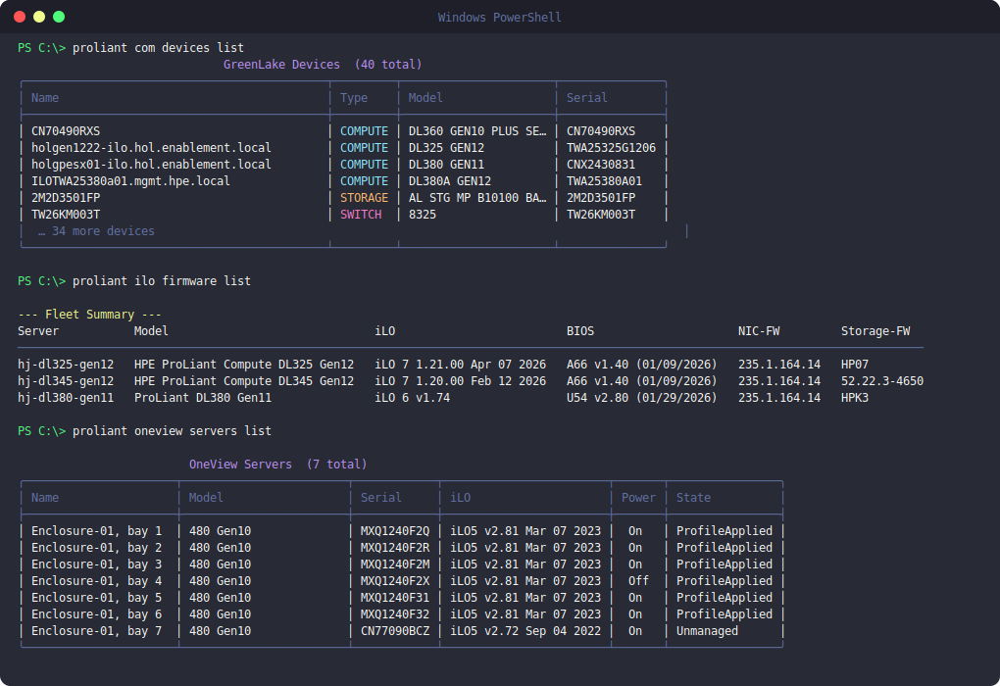

# HPE ProLiant Unified CLI

**proliant** is a unified CLI for HPE ProLiant environments. It lets you retrieve and inspect server inventory and details across **HPE ProLiant iLO**, **Compute Ops Management (COM)**, and **Synergy OneView** — and includes built-in tools to browse **HPE Service Pack for ProLiant (SPP)** release contents directly from the terminal.

Whether you manage a handful of bare-metal servers or a large fleet across multiple management platforms, `proliant` gives you a single consistent interface — cross-platform, no Python required. Query firmware versions across hundreds of iLO nodes in seconds, browse your Compute Ops Management device inventory, or inspect servers managed by HPE Synergy OneView — all without opening a browser or logging into a GUI.

> **Disclaimer:** This is a side project — not affiliated with or supported by HPE. Great for exploring and gathering information; exercise the usual caution with any change operations.

## Installation

### Linux / macOS

```bash
sh -c "$(curl -fsSL https://raw.githubusercontent.com/hjma29/proliant-cli/main/install.sh)"
```

### Windows

Run the one-liner in PowerShell — it downloads and launches the GUI installer
(accept the single UAC prompt):

```powershell
Invoke-RestMethod https://raw.githubusercontent.com/hjma29/proliant-cli/main/install.ps1 | Invoke-Expression
```

Or download `proliant-cli-windows-setup.exe` from the
[latest release](https://github.com/hjma29/proliant-cli/releases/latest) and
run it directly. It installs to `C:\Program Files\proliant-cli`, adds that
folder to your PATH, and creates an Add/Remove Programs entry.

## Screenshots




## Usage

```
proliant ilo <resource> <action>      # Direct iLO Redfish management
proliant com <resource> <action>      # HPE Compute Ops Management
proliant oneview <resource> <action>  # HPE OneView management
proliant spp <action>                 # HPE Service Pack for ProLiant (SPP)
```

Use `--help` at any level (`proliant ilo --help`, `proliant ilo firmware --help`) for full options.

### iLO

Talks directly to iLO via Redfish. Requires a `hosts-ilo.ini` in the current directory — run `proliant ilo init` to create one.

```bash
# Inventory
proliant ilo servers list                        # List all configured hosts
proliant ilo servers describe <host>             # Full server details
proliant ilo firmware list                       # Firmware summary across all hosts
proliant ilo firmware list <host>                # Firmware for a specific host
proliant ilo firmware list --fields bios,ilo,nic-fw
proliant ilo nic list                            # NIC link state + MAC address
proliant ilo storage list                        # Storage controllers + drives
proliant ilo cpu list                            # CPU models + microcode
proliant ilo memory list                         # DIMM details
proliant ilo reports memory                      # Fleet memory report

# Firmware upgrade
proliant ilo firmware upgrade <host> --dry-run   # Preview without changes
proliant ilo firmware upgrade <host>             # Upgrade from HPE SDR
proliant ilo firmware upgrade <host> --reboot    # Upgrade and reboot

# Power / boot
proliant ilo power reset <host>
proliant ilo boot describe <host>
proliant ilo boot set <host> pxe
```

### COM

```bash
proliant com login                               # Login (Okta or --api-client)
proliant com logout
proliant com devices list                        # All devices in workspace
proliant com servers list                        # Servers with firmware info
proliant com servers describe <name>
proliant com bundles list                        # Available SPP bundles
proliant com bundles list --gen 12 --type base
proliant com workspaces list
proliant com reports gpu                         # GPU inventory report
proliant com reports memory
```

### OneView

```bash
proliant oneview servers list
proliant oneview firmware list
proliant oneview networks list
proliant oneview networks describe <name>
proliant oneview networksets list
proliant oneview networksets describe <name>
proliant oneview uplinksets list
proliant oneview uplinksets describe <name>
proliant oneview server-profiles list
proliant oneview server-profiles describe <name>
proliant oneview enclosures list
proliant oneview enclosures describe <name>
proliant oneview mac list --address <mac>
proliant oneview mac list --network-name <name>
proliant oneview mac describe <mac>
proliant oneview reports memory
```

### SPP (Service Pack for ProLiant)

```bash
proliant spp list                                # List available SPP releases
proliant spp inspect <version>                   # Inspect SPP contents
proliant spp diff <version1> <version2>          # Compare two SPP releases
```

## Self-update

```bash
proliant update                                  # Update to the latest release
```
