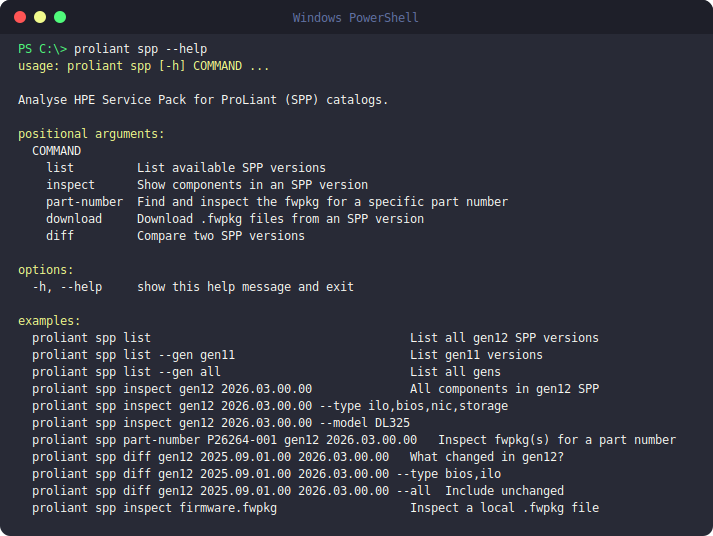

# Additional Setup

Extra features and configuration that apply across `ilo`, `com`, and
`oneview`.

## SPP (Service Pack for ProLiant)

Browse Service Pack for ProLiant release contents without downloading the
full ISO:

```bash
proliant spp list                                # List available SPP releases
proliant spp inspect <version>                   # Inspect SPP contents
proliant spp diff <version1> <version2>          # Compare two SPP releases
```

## Local inventory file

`proliant setup` is the guided way to manage your local inventory file — it
can view, add, edit, or delete entries (both iLO hosts and an optional
`[oneview]` appliance section), test connectivity live, and open the file
directly in your `$EDITOR`/`$VISUAL` if you'd rather hand-edit it. Every
save keeps rotating backups, so an accidental edit or deletion is always
recoverable.

```bash
proliant setup
```

`proliant` looks for the local inventory file in this order: an explicit env
override, then `~/.config/proliant/ilo/`, then the current directory. It's
only used by `ilo` and `oneview` — `com` authenticates against the cloud API
directly.

## Shell completion

Both installers (`install.ps1` / `install.sh`) wire up dynamic tab completion
automatically — PowerShell, bash, and zsh are all supported out of the box.
If completion ever stops working after a shell/profile change, open a new
terminal; if it's still missing, re-run the installer to regenerate the
completion block.

## Self-update

```bash
proliant version    # Show installed version; offers to upgrade if a newer release exists
```

## Telemetry

`proliant` uses two small, anonymous signals. Neither ever includes personal
data — no IPs, hostnames, credentials, or command-line arguments are sent.

- **Install/update counter** (always on) — a single ping that counts installs
  and updates by operating system only, so we know the tool is actually being
  used.
- **Error telemetry** (opt-in, off by default) — if you turn it on, only the
  crash traceback for a genuine unexpected bug is sent to
  [Sentry](https://sentry.io), our error-tracking service, so we can find and
  fix it. Expected errors (wrong password, timeouts, missing files, and the
  like) are never sent, and any IPs, hostnames, or credentials are stripped
  before anything leaves your machine.

Check or change the error telemetry setting any time:

```bash
proliant setting telemetry
```

This shows whether it's currently on or off and asks you to confirm before
switching it.

## Screenshots



<!--
  ADD MORE REAL-USAGE SCREENSHOTS HERE (zero rebuild — just push):
  1. Drop a PNG into  docs/assets/  (e.g. setup-menu.png)
  2. Add another image line below, e.g.:

  
-->

## Video walkthrough

<!--
  [](https://youtu.be/YOUR_VIDEO_ID)
-->

_Coming soon._
