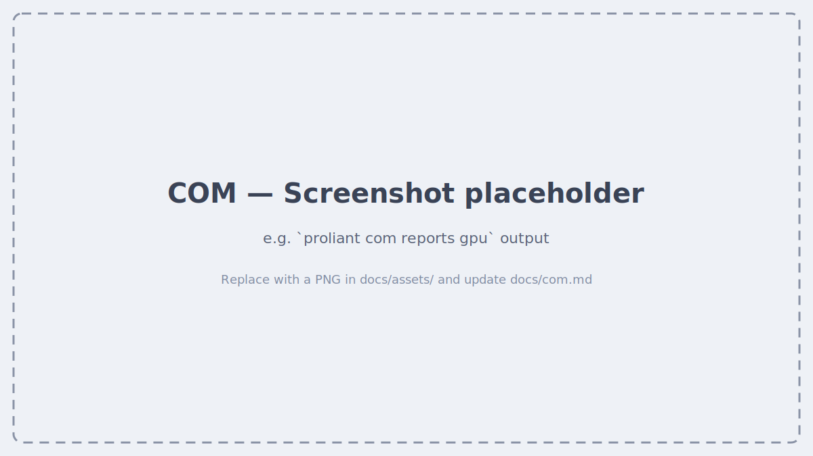

# COM (Compute Ops Management)

`proliant com` talks to the HPE Compute Ops Management (COM) cloud API. Unlike
`ilo` and `oneview`, it doesn't use `inventory.ini` — you authenticate once
and the CLI stores a token for subsequent calls.

## Login

```bash
proliant com login                                # Login (Okta or --api-client)
proliant com logout
```

Use `--api-client` if you'd rather authenticate with a GreenLake API client
(client ID/secret) instead of interactive Okta login. See
[Additional Setup](additional-setup.md) if login ever fails with a 404 on
`compute-ops-mgmt` calls — that's almost always a stale/missing GLP
credential.

## Inventory & reports

```bash
proliant com devices list                         # All devices in workspace
proliant com servers list                         # Servers with firmware info
proliant com servers describe <name>
proliant com bundles list                         # Available SPP bundles
proliant com bundles list --gen 12 --type base
proliant com reports gpu                          # GPU inventory report
proliant com reports memory
```

## Workspaces

If your account has access to multiple GreenLake workspaces, switch between
them without logging out:

```bash
proliant com workspaces list
proliant com workspaces use MyWorkspace           # Switch active workspace
```

## Screenshots



<!--
  HOW TO REPLACE THE PLACEHOLDER ABOVE (zero rebuild — just push):
  1. Drop a PNG into  docs/assets/  (e.g. com-gpu-report.png)
  2. Swap the line above for something like:

  
-->

## Video walkthrough

<!--
  [](https://youtu.be/YOUR_VIDEO_ID)
-->

_Coming soon._
