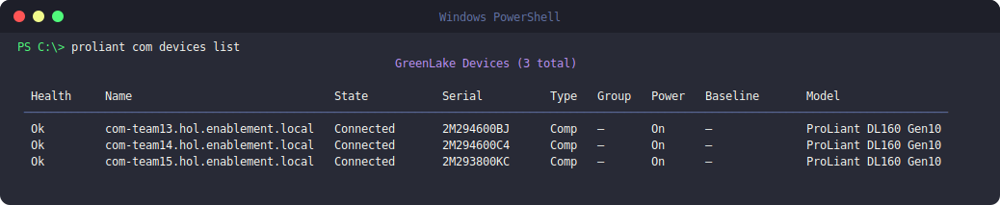

# COM (Compute Ops Management)

`proliant com` talks to the HPE Compute Ops Management (COM) cloud API. Unlike
`ilo` and `oneview`, it doesn't use a local inventory file — you authenticate
once (with Okta or your HPE GreenLake email/password) and the CLI stores a
token for subsequent calls.

## Login

```bash
proliant com login                                # Interactive login (Okta Verify push)
proliant com logout
```


## Inventory & reports

```bash
proliant com devices list                         # All devices in workspace
proliant com servers list                         # Servers with firmware info
proliant com servers describe <name>
proliant com bundles list                         # Available SPP bundles
proliant com reports gpu                          # GPU inventory report
proliant com reports memory
```

## Workspaces

If your account has access to multiple GreenLake workspaces, switch between
them without logging out:

```bash
proliant com workspaces list
proliant com workspaces use MyWorkspace           # Switch active workspace
```

## Screenshots



<!--
  ADD MORE REAL-USAGE SCREENSHOTS HERE (zero rebuild — just push):
  1. Drop a PNG into  docs/assets/  (e.g. com-gpu-report.png)
  2. Add another image line below, e.g.:

  
-->

## Video walkthrough


