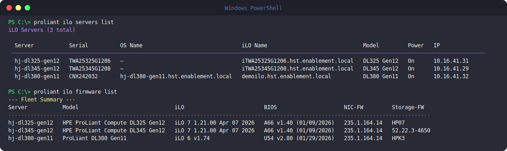

# iLO

`proliant ilo` talks directly to a server's iLO over Redfish. It requires a
local inventory file with the server's iLO address and credentials; run
[`proliant setup`](index.md#connect-your-first-server) to create one.

## Inventory

```bash
proliant ilo servers list                        # List all configured hosts
proliant ilo servers describe <host>              # Full server details
```

## Screenshots



<!--
  ADD MORE REAL-USAGE SCREENSHOTS HERE (zero rebuild — just push):
  1. Drop a PNG into  docs/assets/  (e.g. ilo-firmware-table.png)
  2. Add another image line below, e.g.:

  
-->

## Video walkthrough

<!--
  [](https://youtu.be/YOUR_VIDEO_ID)
-->

_Coming soon._
