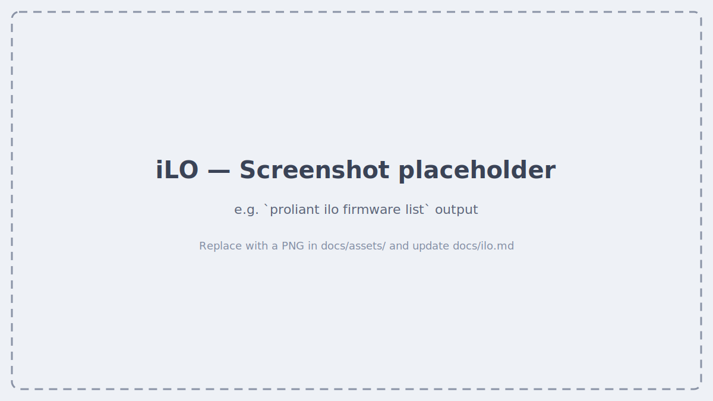

# iLO

`proliant ilo` talks directly to a server's iLO over Redfish. It requires a
local inventory file with the server's iLO address and credentials; run
[`proliant setup`](index.md#connect-your-first-server) to create one.

## Inventory

```bash
proliant ilo servers list                        # List all configured hosts
proliant ilo servers describe <host>              # Full server details
proliant ilo firmware list                        # Firmware summary across all hosts
proliant ilo firmware list <host>                  # Firmware for a specific host
proliant ilo firmware list --fields bios,ilo,nic-fw
proliant ilo nic list                             # NIC link state + MAC address
proliant ilo storage list                         # Storage controllers + drives
proliant ilo cpu list                              # CPU models + microcode
proliant ilo memory list                           # DIMM details
proliant ilo reports memory                        # Fleet memory report
```

## Screenshots



<!--
  HOW TO REPLACE THE PLACEHOLDER ABOVE (zero rebuild — just push):
  1. Drop a PNG into  docs/assets/  (e.g. ilo-firmware-table.png)
  2. Swap the line above for something like:

  
-->

## Video walkthrough

<!--
  [](https://youtu.be/YOUR_VIDEO_ID)
-->

_Coming soon._
