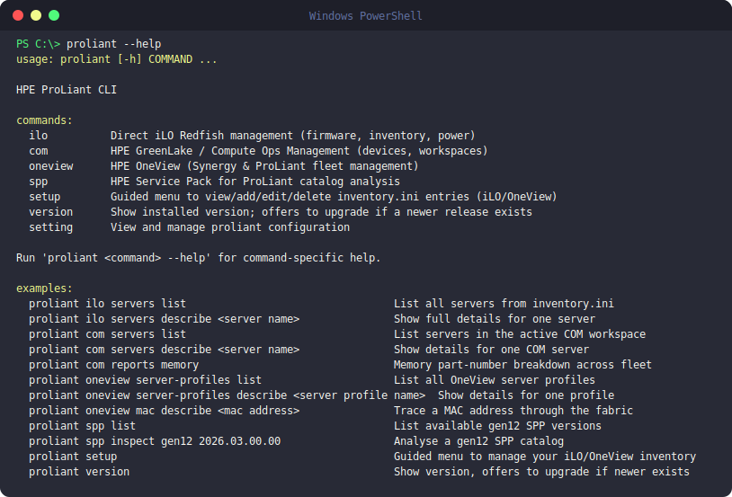

# Getting Started



```bash
proliant --help
```



## Connect your first server

Run `proliant setup` to manage your local inventory file — a guided menu to view,
add, edit, or delete iLO servers (and, optionally, OneView appliance).

```bash
proliant setup
```

COM doesn't use a local inventory file — it authenticates against the cloud
API directly with `proliant com login`. See the [COM](com.md) page for
details.

## Linux terminal Installation
```bash
abuser@vm-ubuntu-413:~$                                                                                 sh -c "$(curl -fsSL https://raw.githubusercontent.com/hjma29/proliant-cli/main/install.sh)"
labuser@vm-ubuntu-413:~$ sh -c "$(curl -fsSL https://raw.githubusercontent.com/hjma29/proliant-cli/main/install.sh)"
proliant-cli installer
══════════════════════════════════════
Fetching latest release...
Downloading v1.0.31 (proliant-cli-linux-x86)...
######################################################################### 100.0%

  Installed : /home/labuser/.local/bin/proliant
  PATH      : added $HOME/.local/bin to /home/labuser/.bashrc
  Note      : run 'source /home/labuser/.bashrc' or open a new terminal
  Version:   v1.0.31

Setting up tab completion (dynamic)...
✓ Tab completion added to /home/labuser/.bashrc
  Run: source /home/labuser/.bashrc

Run 'proliant version' to verify.

labuser@vm-ubuntu-413:~$ proliant version
proliant: command not found
labuser@vm-ubuntu-413:~$ source /home/labuser/.bashrc 
labuser@vm-ubuntu-413:~$ proliant version
proliant 1.0.31
Checking for updates...
✓ Already up to date.
labuser@vm-ubuntu-413:~$ proliant setup

proliant setup -- manage your servers in inventory.ini

This will create: /home/labuser/.config/proliant-cli/inventory.ini

  (no entries yet)

What would you like to do?
    1. Add a new entry
    2. Open inventory.ini in editor
    3. Done
  Select (1): 1
    1. iLO server
    2. OneView appliance
  Add a (1): 2

Add a OneView appliance
  OneView appliance IP / hostname: 10.16.43.100
  Username (Administrator): 
  Password: ********
  Testing connection to 10.16.43.100...
  OK - Connected successfully.
  Saved to /home/labuser/.config/proliant-cli/inventory.ini

#  Name     Type     Host          Username       Status     
1  oneview  oneview  10.16.43.100  Administrator  Reachable  

What would you like to do?
    1. Add a new entry
    2. Edit an entry
    3. Delete an entry
    4. Open inventory.ini in editor
    5. Done
  Select (5): 

Setup complete!
  Config: /home/labuser/.config/proliant-cli/inventory.ini
  Try: proliant setup any time to add, edit, or re-test entries.

labuser@vm-ubuntu-413:~$ proliant oneview server
server           server-profile   server-profiles  servers
labuser@vm-ubuntu-413:~$ proliant oneview server-profiles list
                           Server Profiles  (6 total)                           
                                                                                
  Name                     Server                  Status    State    Descrip  
 ────────────────────────────────────────────────────────────────────────────── 
  aci-FM-host1             Enclosure-01, bay 3    Critical   Normal            
  aci-Mapped-host1         Enclosure-01, bay 5    Warning    Normal   —         
  aci-vc-LAG-host1         Enclosure-01, bay 4       OK      Normal            
  aci-vc-tunnel-host1      Enclosure-01, bay 1       OK      Normal            
  aci-vc-tunnel-host2      Enclosure-01, bay 2       OK      Normal            
  ocp-single-node          Enclosure-01, bay 6    Critical   Normal   —  
```

## Video walkthrough for Windows .exe Download Wizard Installation


---

- [Source on GitHub](https://github.com/hjma29/proliant-cli)
- [Full README & command reference](https://github.com/hjma29/proliant-cli#readme)
- [Releases & downloads](https://github.com/hjma29/proliant-cli/releases)
