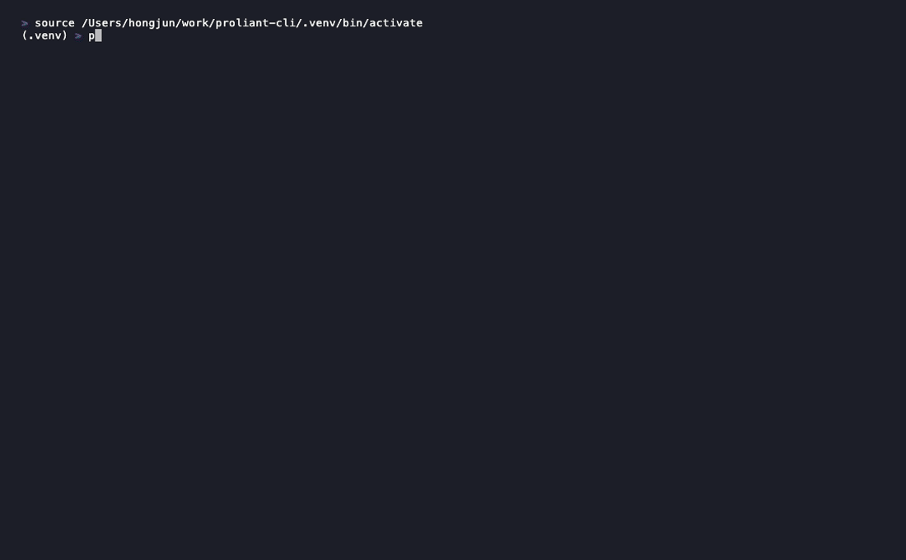

# Getting Started

`proliant` is a cross-platform CLI for HPE ProLiant environments. From a single
terminal you can inspect server inventory and firmware across **iLO
(Redfish)**, **Compute Ops Management (COM)**, and **Synergy OneView**, and
browse **Service Pack for ProLiant (SPP)** contents — no Python or GUI
required.

!!! warning "Disclaimer"
    This is a side project, not affiliated with or supported by HPE. Great for
    exploring and gathering information; exercise the usual caution with any
    change operations.

## See it in action



## Install

=== "Windows"

    Run the one-liner in PowerShell — it downloads and launches the GUI
    installer (accept the single UAC prompt):

    ```powershell
    Invoke-RestMethod https://raw.githubusercontent.com/hjma29/proliant-cli/main/install.ps1 | Invoke-Expression
    ```

    Or download `proliant-cli-windows-setup.exe` from the
    [latest release](https://github.com/hjma29/proliant-cli/releases/latest)
    and run it directly. It installs to `C:\Program Files\proliant-cli`, adds
    that folder to your PATH, and creates an Add/Remove Programs entry.

=== "Linux / macOS"

    ```bash
    sh -c "$(curl -fsSL https://raw.githubusercontent.com/hjma29/proliant-cli/main/install.sh)"
    ```

Both installers also wire up dynamic tab completion for your shell. Open a
new terminal, then confirm it's working:

```bash
proliant --help
```

## Connect your first server

Run `proliant setup` to manage your `inventory.ini` — a guided menu to view,
add, edit, or delete iLO servers (and, optionally, a OneView appliance). The
entries table shows a live Status column (Reachable / Timeout / Unreachable /
Auth failed), checked in parallel on start and refreshed after any change.
Safe to run any time to add, change, or remove entries.

```bash
proliant setup
```

COM doesn't use `inventory.ini` — it authenticates against the cloud API
directly with `proliant com login`. See the [COM](com.md) page for details.

## Where to go next

- **[iLO](ilo.md)** — direct Redfish management: firmware inventory and
  upgrades, NIC/storage/CPU/memory details, power and boot control.
- **[COM](com.md)** — Compute Ops Management device/server inventory,
  firmware bundles, GPU and health reports from the cloud API.
- **[OneView](oneview.md)** — server profiles, networks, interconnects, and
  an end-to-end fabric map with MAC tracing.
- **[Additional Setup](additional-setup.md)** — SPP browsing, shell
  completion, telemetry opt-out, and self-update.

## Video walkthrough

<!--
  HOW TO ADD A VIDEO (link a thumbnail image to the video URL):
  1. Save a thumbnail into  docs/assets/  (e.g. getting-started-thumb.png)
  2. Replace the line below with something like:
     [](https://youtu.be/YOUR_VIDEO_ID)
-->

_Coming soon._

---

- [Source on GitHub](https://github.com/hjma29/proliant-cli)
- [Full README & command reference](https://github.com/hjma29/proliant-cli#readme)
- [Releases & downloads](https://github.com/hjma29/proliant-cli/releases)
