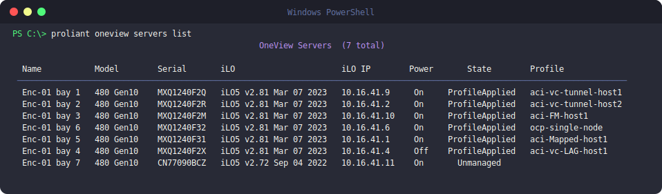

# OneView

`proliant oneview` manages servers through an HPE Synergy OneView appliance.
It requires a local inventory file with a `[oneview]` (or `type = oneview`)
section — run `proliant setup` to add one.

## Multiple appliances

The local inventory file can hold more than one OneView appliance — give each
its own section name and `type = oneview` (`proliant setup` does this for you). With
only one configured, every command just uses it — no extra steps. With two
or more, commands target whichever one is **active**:

```bash
proliant oneview appliances list              # * marks the active appliance
proliant oneview appliances use datacenter-b   # switch which one commands target
```

The active selection persists across commands and terminal sessions until
you switch again.

## Servers & profiles

```bash
proliant oneview servers list
proliant oneview servers firmware list
proliant oneview servers firmware list --server "Enclosure-01, bay 1"
proliant oneview server-profiles list
proliant oneview server-profiles describe <name>
proliant oneview enclosures list
proliant oneview enclosures describe <name>
```

## Firmware

```bash
proliant oneview firmware bundles
proliant oneview firmware repository
proliant oneview firmware compliance
```

## Networking

```bash
proliant oneview networks list
proliant oneview networks describe <name>
proliant oneview networksets list
proliant oneview networksets describe <name>
proliant oneview uplinksets list
proliant oneview uplinksets describe <name>
proliant oneview mac list --address <mac>
proliant oneview mac list --network-name <name>
proliant oneview mac describe <mac>
```

## Reports & upgrade planning

```bash
proliant oneview reports memory
proliant oneview upgrade readiness              # pre-upgrade readiness report
proliant oneview upgrade cleanup                # preview unused firmware baselines
proliant oneview upgrade cleanup --yes          # delete unused baselines (free disk)
```

## Screenshots



<!--
  ADD MORE REAL-USAGE SCREENSHOTS HERE (zero rebuild — just push):
  1. Drop a PNG into  docs/assets/  (e.g. oneview-fabric-map.png)
  2. Add another image line below, e.g.:

  
-->

## Video walkthrough

<!--
  [](https://youtu.be/YOUR_VIDEO_ID)
-->

_Coming soon._
