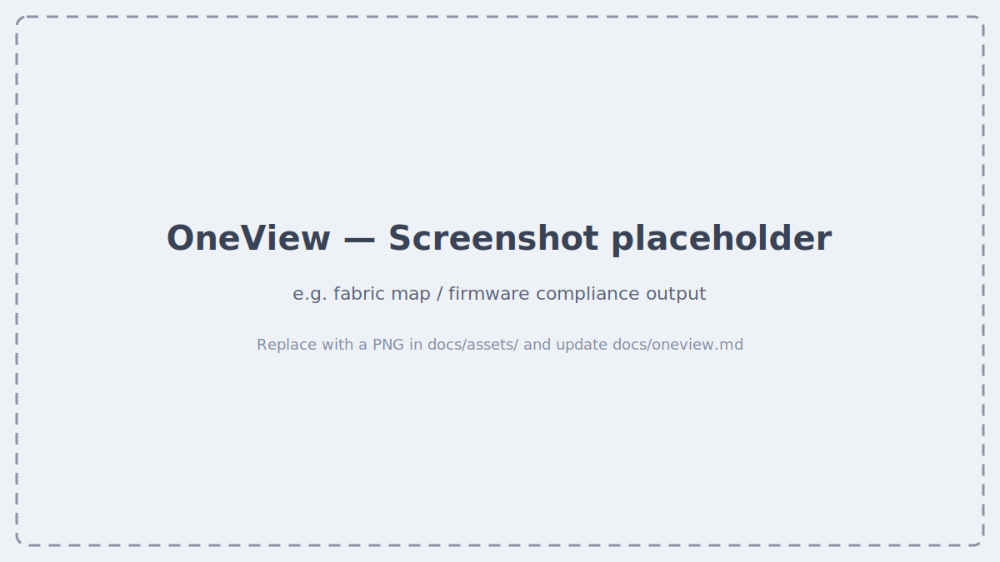

# OneView

`proliant oneview` manages servers through an HPE Synergy OneView appliance.
It requires an `inventory.ini` with a `[oneview]` (or `type = oneview`)
section — run `proliant setup` to add one.

## Multiple appliances

`inventory.ini` can hold more than one OneView appliance — give each its own
section name and `type = oneview` (`proliant setup` does this for you). With
only one configured, every command just uses it — no extra steps. With two
or more, commands target whichever one is **active**:

```bash
proliant oneview appliances list              # * marks the active appliance
proliant oneview appliances use datacenter-b   # switch which one commands target
```

The active selection persists across commands and terminal sessions until
you switch again.

## Servers & profiles

```bash
proliant oneview servers list
proliant oneview servers firmware list
proliant oneview servers firmware list --server "Enclosure-01, bay 1"
proliant oneview server-profiles list
proliant oneview server-profiles describe <name>
proliant oneview enclosures list
proliant oneview enclosures describe <name>
```

## Firmware

```bash
proliant oneview firmware bundles
proliant oneview firmware repository
proliant oneview firmware compliance
```

## Networking

```bash
proliant oneview networks list
proliant oneview networks describe <name>
proliant oneview networksets list
proliant oneview networksets describe <name>
proliant oneview uplinksets list
proliant oneview uplinksets describe <name>
proliant oneview mac list --address <mac>
proliant oneview mac list --network-name <name>
proliant oneview mac describe <mac>
```

## Reports & upgrade planning

```bash
proliant oneview reports memory
proliant oneview upgrade readiness              # pre-upgrade readiness report
proliant oneview upgrade cleanup                # preview unused firmware baselines
proliant oneview upgrade cleanup --yes          # delete unused baselines (free disk)
```

### Upgrade readiness & disk cleanup

`proliant oneview upgrade readiness` is a **read-only** pre-upgrade check. It
reports the appliance software version, the supported Synergy Composer
upgrade path (with the recommended next hop and full milestone chain to the
latest release), and a PASS/WARN/FAIL assessment of appliance disk space,
memory/CPU, active alerts, backup freshness, logical interconnect
consistency, and interconnect redundancy. It never modifies anything.

`proliant oneview upgrade cleanup` frees appliance disk by removing **unused**
firmware baselines (SPP/SSP) — those not assigned to any logical enclosure,
logical interconnect, or server profile, and older than your currently
assigned baseline. Newer unused baselines are retained as upgrade targets. It
defaults to a dry-run preview; pass `--yes` to delete. This only removes
files from the appliance repository and never touches running enclosures or
interconnects (OneView also blocks deletion of any in-use baseline
server-side). Unused baselines that only exist in an **external** firmware
repository (added under Firmware Bundles > External Repositories) are listed
separately as informational — OneView never allows deleting these via the
API, and their reported size isn't appliance disk, so they're excluded from
the reclaimable total.

`proliant oneview firmware compliance` checks every firmware-managed server
profile against each registered baseline that's newer than what's currently
assigned anywhere (the same "candidate" bundles `upgrade cleanup` retains as
upgrade targets), using OneView's real per-component compliance check. Each
row shows whether an update is required and how many components need it. The
GUI's Update Category (Recommended/Optional) and Estimated Update Time
columns are computed by an internal component-diff engine and aren't exposed
via the REST API, so they aren't shown here.

## Screenshots



<!--
  HOW TO REPLACE THE PLACEHOLDER ABOVE (zero rebuild — just push):
  1. Drop a PNG into  docs/assets/  (e.g. oneview-fabric-map.png)
  2. Swap the line above for something like:

  
-->

## Video walkthrough

<!--
  [](https://youtu.be/YOUR_VIDEO_ID)
-->

_Coming soon._
